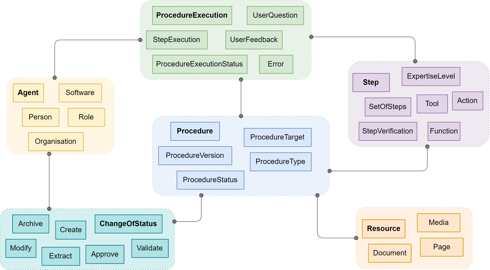

# Procedural Knowledge Ontology (PKO)

Repository for the Procedural Knowledge Ontology (PKO) and related modules.

| Prefix    | IRI |
| -- | ------- |
| pko:  | [https://w3id.org/pko#](https://w3id.org/pko#)  |
| pko-ind:  | [https://w3id.org/pko/industry#](https://w3id.org/pko/industry#)  |

## Ontology purpose and scope

Procedural Knowledge (PK) is knowing how to perform some tasks, as opposed to descriptive/declarative knowledge, which is knowing what in terms of facts and notions. 
In industry, PK refers in general to structured processes to be followed, and can be related to both production (e.g., procedure on the production line in a plant) and services (e.g., procedure for troubleshooting during customer support); to specific technical expertise (e.g., procedure to set up a specific machine) and general regulations and best practices (e.g., safety procedures, activities to minimise environmental impact).

The Procedural Knowledge Ontology (PKO) is defined to support the holistic governance of procedural knowledge in its entire life cycle, from elicitation to management, from access to exploitation of explicit PK. An overview of the concepts covered by the ontology is represented in the following figure.

## Content of the repository

The resources associated with the requirements specification are available in the [`requirements`](./requirements) folder.

The RDF files describing the different versions of the ontology and its modules can be found in the folder [pko](./pko). A [Chowlk](https://chowlk.linkeddata.es/) diagram for the current version of the ontology can be found in the [ontology](./ontology) folder.

The Widoco tool is used to automatise the ontology publication through the `run-onto.sh` script as described in the template repo https://github.com/cefriel/ontology-template.
